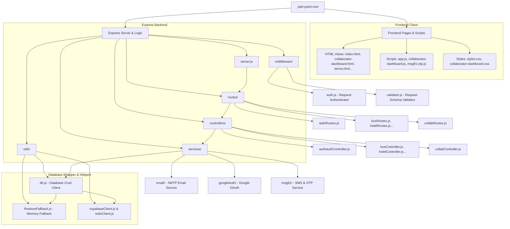
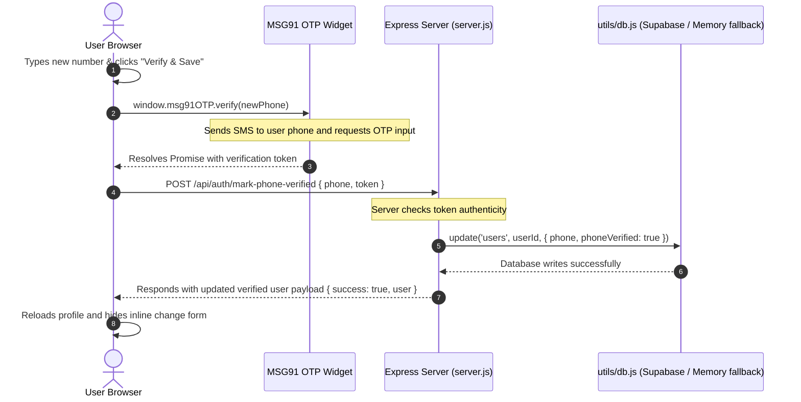

# Yatri Point Project Architecture & Structure

Welcome to the **Yatri Point** codebase! This document provides a visual and structured walkthrough of the project’s directory structure, architectural design, and system data flows.

---

## 🏛️ System Architecture Overview

Yatri Point is designed as a modular **Client-Server web application**:
* **Frontend:** Built with Vanilla HTML5, CSS3 (using custom variables and responsiveness), and modern client-side JavaScript.
* **Backend:** Built on Node.js and Express.js, handling API endpoints, payment requests (Razorpay/UPI), and notification/verification APIs.
* **Database Layer:** Uses **Supabase (PostgreSQL)** as the primary datastore, with a robust **In-Memory fallback database** (`memoryDb`) that automatically boots up in local/offline environments if Supabase credentials are not configured in `.env`.

---

## 📂 Codebase Structure Graph

The following Mermaid diagram visualizes the layout of the project, separating frontend assets, routing paths, controllers, database helpers, and third-party integrations:



---

## 📁 Directory Walkthrough

Here is a detailed summary of the main directories and their files:

### 🌐 Frontend Assets (Root Directory)
* **[index.html](file:///c:/Users/jigar/OneDrive/Music/BookNow/index.html):** The primary entry point for travelers. Contains forms for Bus, Hotel, Rapid Car searches, and the Profile section.
* **[app.js](file:///c:/Users/jigar/OneDrive/Music/BookNow/app.js):** The brain of the frontend. Manages client-side routing, renders listings dynamically, handles payments (Razorpay/UPI ID/UPI QR), coordinates the MSG91 widget OTP calls, and synchronizes the session state.
* **[styles.css](file:///c:/Users/jigar/OneDrive/Music/BookNow/styles.css):** The main design system file containing color tokens, responsive dark-theme variables, and visual utility styles.
* **[collaborator-dashboard.html](file:///c:/Users/jigar/OneDrive/Music/BookNow/collaborator-dashboard.html) / [.js](file:///c:/Users/jigar/OneDrive/Music/BookNow/collaborator-dashboard.js) / [.css](file:///c:/Users/jigar/OneDrive/Music/BookNow/collaborator-dashboard.css):** The business collaborator dashboard, where partners list their buses, rooms, cabs, and cafes.
* **[collab-routes.html](file:///c:/Users/jigar/OneDrive/Music/BookNow/collab-routes.html):** Portal for managing specific collaborator routes.
* **[msg91-otp.js](file:///c:/Users/jigar/OneDrive/Music/BookNow/msg91-otp.js):** Custom wrapper to load the MSG91 Javascript OTP widget and manage the confirmation promises for SMS validation.
* **E-Tickets:**
  * `e-ticket.html` (Buses)
  * `e-ticket-hotel.html` (Hotels)
  * `e-ticket-cab.html` (Cabs)
  * `e-ticket-cafe.html` (Cafes)

### ⚙️ Backend Folders
* **[server.js](file:///c:/Users/jigar/OneDrive/Music/BookNow/server.js):** Express application configuration. Sets up routing, static asset serving, CORS headers, Redis, and initializes database connectors.
* **`routes/`:** Maps endpoints to controllers:
  * `authRoutes.js`: Login, signup, token refreshes, and profile updates.
  * `busRoutes.js`, `hotelRoutes.js`, `cabRoutes.js`, `cafeRoutes.js`: Search and retrieve listings.
  * `collabRoutes.js`: Submitting and managing partner accounts.
* **`controllers/`:** Implements endpoint-specific business logic:
  * `auth/authController.js`: Controls login/registration, OTP verification, and JWT issuance.
  * `collabController.js`: Manages registrations and partner approvals.
  * `verificationController.js`: Email and phone checks.
* **`middleware/`:**
  * `auth.js`: Express middleware verifying JWT access tokens.
  * `validator.js`: Verifies schemas and sanitizes input data.
* **`services/`:** Communicates with third-party providers:
  * `email/emailService.js`: Delivers transactional messages (SMTP/NodeMailer).
  * `googleAuth/googleAuthService.js`: Decodes Google JWT tokens for single sign-on.
  * `msg91/msg91Service.js`: Connects to MSG91 API to deliver OTPs.
* **`utils/`:** Common backend utilities:
  * `db.js`: Standardized CRUD API wrapper with transparent Supabase and local Memory fallback routing.
  * `supabaseClient.js`: Initialized client context for Supabase.
  * `firestoreFallback.js`: In-memory hash-map cache acting as a local database.
  * `redisClient.js`: Connection client for Redis cache.
  * `jwt/jwtHelper.js` / `otp/otpHelper.js`: Utility libraries for authentication.

---

## 🔄 Data Verification Flow (OTP Phone Update Example)

The diagram below shows how the client and server communicate securely to verify and change a phone number:



---

## ⚡ Key Architectural Patterns

1. **Supabase Auto-Fallback:**
   ```javascript
   // Automatically switches storage depending on credentials availability
   export async function update(table, id, data) {
     if (!isSupabaseAvailable()) {
       const store = getMemoryStore(table);
       if (store) {
         const existing = store.get(id) || {};
         const record = { ...existing, ...data };
         store.set(id, record);
         return record;
       }
       return;
     }
     // ... Supabase update code ...
   }
   ```
2. **Unified Authentication:** JWT-based stateless authentication. Refresh tokens are stored securely to maintain user sessions across loads.
3. **Decoupled API Routing:** The database queries (`utils/db.js`) are separated from business logic (`controllers/`) and request definitions (`routes/`), allowing easy migration from SQL to firestore/other databases in the future if required.
