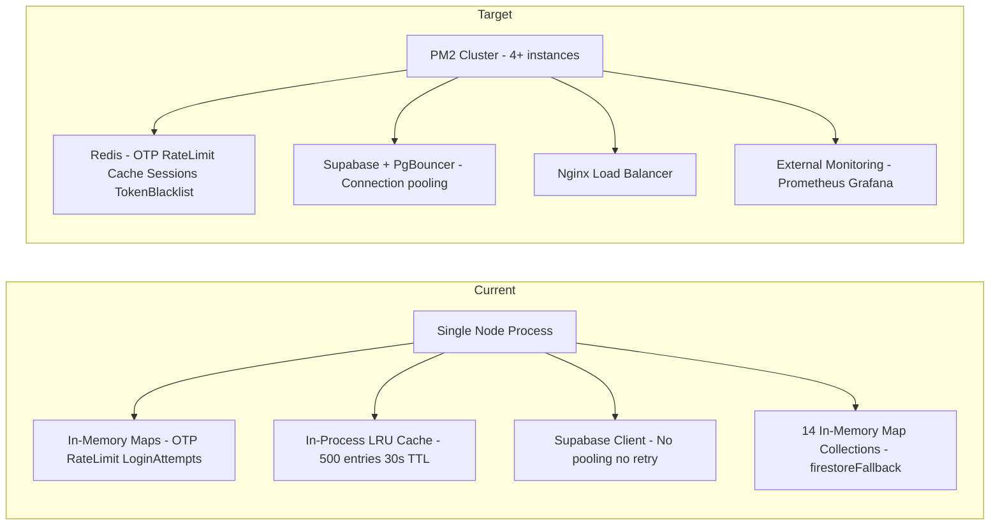
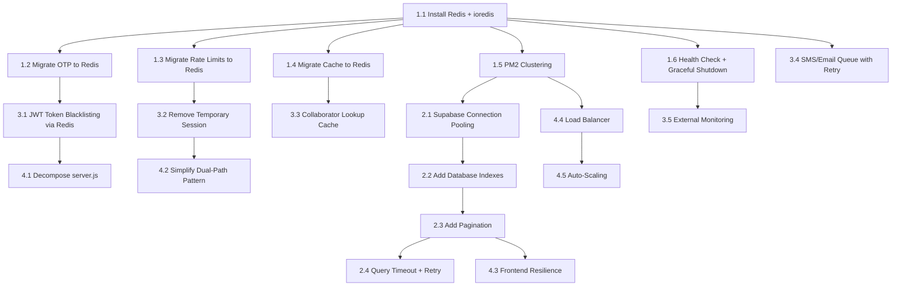

# BookNow / Yatri Point — Scalability Implementation Plan

**Goal:** Ensure the application handles **1,000–15,000 concurrent users** without crashing.

---

## Executive Summary

The current architecture has **12 critical scalability bottlenecks** that will cause failures under load. The root cause is **single-process in-memory state** — every rate limit, OTP, cache entry, session, and database fallback lives in one Node.js process. Scaling to multiple instances or processes will immediately break all of these. The plan below addresses every bottleneck in 4 phases, with Phase 1 being the minimum required to survive 1,000+ concurrent users.

---

## Architecture Overview — Current vs. Target



---

## Critical Bottlenecks Identified

| # | Bottleneck | File | Impact at 1K+ Users |
|---|-----------|------|---------------------|
| 1 | In-memory OTP store | [`otpHelper.js`](utils/otp/otpHelper.js) | OTPs lost on restart; not shared across instances |
| 2 | In-memory rate limits | [`server.js`](server.js:114) | Rate limits reset on restart; per-process only |
| 3 | In-memory login attempts | [`server.js`](server.js:121) | Admin brute-force protection fails across instances |
| 4 | In-process LRU cache | [`cache.js`](utils/cache.js) | Cache misses on different instances; 500-entry limit too small |
| 5 | 14 in-memory Map collections | [`firestoreFallback.js`](utils/firestoreFallback.js) | Entire DB fallback in one process memory — OOM risk |
| 6 | No connection pooling | [`supabaseClient.js`](utils/supabaseClient.js) | Supabase connection exhaustion under concurrent queries |
| 7 | No token blacklisting | [`jwtHelper.js`](utils/jwt/jwtHelper.js) | Compromised tokens cannot be revoked |
| 8 | No pagination on list queries | [`db.js`](utils/db.js:104) | Fetching all records then filtering in JS — memory spike |
| 9 | In-memory DB filtering | [`busService.js`](services/busService.js:266) | `getActiveBusesByRoute` fetches ALL buses, filters in JS |
| 10 | requireCollaborator DB lookup per request | [`authMiddleware.js`](middleware/auth/authMiddleware.js:113) | No caching — DB hit on every authenticated collaborator request |
| 11 | Temporary session fallback | [`authController.js`](controllers/auth/authController.js:266) | Unverified sessions with real JWT tokens when DB is offline |
| 12 | In-memory performance metrics | [`performanceMonitor.js`](utils/otp/performanceMonitor.js) | No external monitoring; metrics lost on restart |
| 13 | Monolithic server.js | [`server.js`](server.js) | 1330 lines mixing routes, config, business logic — hard to maintain |
| 14 | No SMS retry/queue | [`smsService.js`](services/smsService.js) | Failed notifications silently dropped |
| 15 | Frontend localStorage state | [`app.js`](app.js) | No request deduplication, retry logic, or token refresh coordination |

---

## Phase 1 — Foundation: Redis + Clustering (Must-Do for 1K Users)

This phase replaces all single-process state with Redis and enables multi-process clustering.

### 1.1 Install and Configure Redis

**What:** Add Redis as the centralized state store for all distributed data.

**Files to create:**
- `utils/redisClient.js` — Redis connection singleton using `ioredis` with retry strategy, connection timeout, and cluster support

**Files to modify:**
- [`package.json`](package.json) — Add `ioredis` dependency
- `.env.example` — Add `REDIS_URL`, `REDIS_PASSWORD`, `REDIS_TLS` env vars

**Implementation details:**
```
Redis Client Configuration:
- Use ioredis library with built-in retry and cluster support
- REDIS_URL = redis://localhost:6379 for local, rediss:// for production TLS
- Connection retry strategy: exponential backoff starting at 200ms, max 5s
- Enable ready check and offline queue for graceful reconnection
- Separate subscriber connection for cache invalidation events
```

### 1.2 Migrate OTP Storage to Redis

**What:** Replace `inMemoryOtpStore` Map with Redis hashes with TTL.

**Files to modify:**
- [`utils/otp/otpHelper.js`](utils/otp/otpHelper.js) — Replace all `inMemoryOtpStore.set/get/delete` with Redis operations

**Implementation details:**
```
OTP Redis Schema:
- Key: otp:email:{normalizedEmail} or otp:phone:{normalizedPhone}
- Value: Redis hash { code, createdAt, attempts, maxAttempts, verified }
- TTL: 5 minutes (matches current OTP expiry)
- Rate limit keys: otp:ratelimit:email:{email} and otp:ratelimit:phone:{phone}
  - Value: count of requests
  - TTL: 60 seconds (1-minute cooldown)
- Verification attempt tracking: otp:attempts:{email/phone}
  - Value: count of failed attempts
  - TTL: same as OTP TTL
  - Max 3 attempts, then OTP invalidated
```

### 1.3 Migrate Rate Limiting to Redis

**What:** Replace `apiRateLimits` Map and `loginAttempts` Map with Redis-backed rate limiting.

**Files to modify:**
- [`server.js`](server.js) — Remove `apiRateLimits` and `loginAttempts` Maps; use `express-rate-limit` with `rate-limit-redis` store
- [`server.js`](server.js:114) — Replace `checkAdminLoginRateLimit` with Redis-based rate limiter

**Files to create:**
- `middleware/rateLimiter.js` — Configured rate limiters for different endpoints

**Implementation details:**
```
Rate Limit Tiers:
- General API: 100 requests/minute per IP
- Auth endpoints: 5 requests/minute per IP
- OTP send: 1 request/minute per identifier (email/phone)
- Admin login: 5 attempts/15 minutes per IP
- Search endpoints: 30 requests/minute per IP
- Payment endpoints: 10 requests/minute per user

Use express-rate-limit + rate-limit-redis store:
- All limits stored in Redis, shared across PM2 instances
- Custom keyGenerator using IP + optional user ID for authenticated routes
- 429 response with Retry-After header
```

### 1.4 Migrate Response Cache to Redis

**What:** Replace in-process LRU cache with Redis-backed cache.

**Files to modify:**
- [`utils/cache.js`](utils/cache.js) — Rewrite to use Redis for storage instead of in-process Map

**Implementation details:**
```
Redis Cache Implementation:
- Key pattern: cache:{hashed_key} where key = originalUrl + auth header hash
- Value: JSON stringified { body, statusCode, headers, timestamp }
- TTL: configurable per route (default 30s, search results 60s, static data 300s)
- Cache invalidation: Redis Pub/Sub for cross-instance invalidation
  - When one instance calls invalidate(), publish to 'cache:invalidate' channel
  - All instances subscribe and delete matching local Redis keys
- Stats endpoint: SCAN Redis keys matching cache:* pattern for stats
- Max entries: Use Redis maxmemory-policy volatile-ttl for automatic eviction
- Increase from 500 to 10,000+ entries (Redis handles this easily)
```

### 1.5 Add PM2 Clustering

**What:** Run multiple Node.js processes to utilize all CPU cores.

**Files to create:**
- `ecosystem.config.cjs` — PM2 configuration file

**Files to modify:**
- [`package.json`](package.json) — Add `pm2` as dev dependency; add `start:cluster` script

**Implementation details:**
```
PM2 Config:
- instances: max (uses all CPU cores, typically 4-8 on production VMs)
- exec_mode: cluster
- max_memory_restart: 500MB (prevents OOM crashes)
- env_production: NODE_ENV=production, all env vars
- Graceful shutdown: listen for SIGINT, close connections, then exit
- Health check: PM2 wait-ready with app sending ready signal after Redis/Supabase connect
- Log merging: merge_logs=true for consolidated logs
- Auto restart: max_restarts=10, restart_delay=5000
```

### 1.6 Add Graceful Shutdown and Health Check

**What:** Ensure processes handle restarts without dropping requests.

**Files to modify:**
- [`server.js`](server.js) — Add health check endpoint, graceful shutdown handler, ready signal for PM2

**Files to create:**
- `middleware/healthCheck.js` — Health endpoint checking Redis, Supabase, and process memory

**Implementation details:**
```
Health Check Endpoint: GET /health
- Check Redis ping → { redis: 'ok' | 'error' }
- Check Supabase connection → { supabase: 'ok' | 'error' }
- Check process memory usage → { memory: { heapUsed, heapTotal, rss } }
- Return 200 if all OK, 503 if any degraded
- PM2 uses this for process monitoring

Graceful Shutdown:
- On SIGINT/SIGTERM: stop accepting new connections
- Drain in-flight requests (30s timeout)
- Close Redis connections
- Close Supabase connections
- Then exit with code 0
```

---

## Phase 2 — Database Optimization (Must-Do for 5K+ Users)

### 2.1 Supabase Connection Pooling

**What:** Add connection pooling to prevent Supabase connection exhaustion.

**Files to modify:**
- [`utils/supabaseClient.js`](utils/supabaseClient.js) — Configure Supabase client with connection pool settings

**Implementation details:**
```
Supabase Connection Pooling:
- Enable Supavisor (Supabase built-in connection pooler) in transaction mode
- Configure SUPABASE_URL to use pooler endpoint: aws-0-{region}.pooler.supabase.com
- Set connection pool size per instance: 10-20 connections
- Add query timeout: 30s default, 10s for search queries
- Add retry logic: 3 retries with exponential backoff for transient failures
- Add connection health check: periodic ping to detect stale connections
```

### 2.2 Add Database Indexes

**What:** Add indexes for frequently queried columns.

**Files to create:**
- `supabase-migration-0013-indexes.sql` — Migration adding all performance indexes

**Implementation details:**
```sql
-- Auth queries
CREATE INDEX CONCURRENTLY IF NOT EXISTS idx_users_email ON users(email);
CREATE INDEX CONCURRENTLY IF NOT EXISTS idx_users_phone ON users(phone);

-- Bus search (most critical for concurrent load)
CREATE INDEX CONCURRENTLY IF NOT EXISTS idx_collaborator_buses_active_route 
  ON collaborator_buses(is_active, from_city, to_city);
CREATE INDEX CONCURRENTLY IF NOT EXISTS idx_collaborator_buses_collaborator_active 
  ON collaborator_buses(collaborator_id, is_active);

-- Seat queries
CREATE INDEX CONCURRENTLY IF NOT EXISTS idx_collaborator_seats_bus_date 
  ON collaborator_seats(bus_id, travel_date);
CREATE INDEX CONCURRENTLY IF NOT EXISTS idx_collaborator_seats_bus_date_status 
  ON collaborator_seats(bus_id, travel_date, status);

-- Hotel/cab search
CREATE INDEX CONCURRENTLY IF NOT EXISTS idx_collaborator_hotels_active_city 
  ON collaborator_hotels(is_active, city);
CREATE INDEX CONCURRENTLY IF NOT EXISTS idx_collaborator_cabs_active_city 
  ON collaborator_cabs(is_active, city);

-- Orders/bookings
CREATE INDEX CONCURRENTLY IF NOT EXISTS idx_orders_user_status 
  ON orders(user_id, status);
CREATE INDEX CONCURRENTLY IF NOT EXISTS idx_orders_collaborator_status 
  ON orders(collaborator_id, status);
CREATE INDEX CONCURRENTLY IF NOT EXISTS idx_bookings_user 
  ON bookings(user_id);

-- OTP lookups
CREATE INDEX CONCURRENTLY IF NOT EXISTS idx_email_otps_email_created 
  ON email_otps(email, created_at DESC);

-- Collaborator lookups
CREATE INDEX CONCURRENTLY IF NOT EXISTS idx_collabs_user_active 
  ON collabs(user_id, status);
CREATE INDEX CONCURRENTLY IF NOT EXISTS idx_collabs_email 
  ON collabs(email);
```

### 2.3 Add Pagination to List Queries

**What:** Replace fetch-all-then-filter with paginated DB queries.

**Files to modify:**
- [`utils/db.js`](utils/db.js:104) — Add `page` and `pageSize` parameters to `list()` function
- [`services/busService.js`](services/busService.js:266) — Rewrite `getActiveBusesByRoute` to use Supabase filters instead of JS filtering
- All service files — Add pagination support to list endpoints
- All route/controller files — Accept `page` and `limit` query parameters

**Implementation details:**
```
db.js list() function changes:
- Add opts.page (default 1) and opts.pageSize (default 50, max 200)
- For Supabase: use .range(from, to) for offset pagination
- Return { data, total, page, pageSize, hasMore } metadata
- For memory fallback: slice the filtered array

getActiveBusesByRoute rewrite:
- Use Supabase query: .eq('is_active', true).eq('from_city', from).eq('to_city', to)
- Remove in-memory filtering entirely
- Add date filter for travel date
- Return paginated results
```

### 2.4 Add Query Timeout and Retry Logic

**What:** Prevent slow queries from blocking the event loop and handle transient failures.

**Files to modify:**
- [`utils/db.js`](utils/db.js) — Add timeout and retry wrapper around all Supabase operations

**Implementation details:**
```
Query Timeout and Retry:
- Wrap each Supabase query with Promise.race against a timeout promise
- Default timeout: 30s for CRUD, 10s for search, 5s for auth lookups
- Retry policy: 3 retries for transient errors (connection reset, timeout)
- Exponential backoff: 200ms, 500ms, 1000ms
- Only retry on retryable errors (not on validation/auth errors)
- Log slow queries (>5s) for monitoring
```

---

## Phase 3 — Security and Reliability (Must-Do for 10K+ Users)

### 3.1 JWT Token Blacklisting via Redis

**What:** Enable token revocation for logout, compromised tokens, and password changes.

**Files to modify:**
- [`utils/jwt/jwtHelper.js`](utils/jwt/jwtHelper.js) — Add `blacklistToken()` and `isTokenBlacklisted()` functions
- [`middleware/auth/authMiddleware.js`](middleware/auth/authMiddleware.js:38) — Check blacklist in `requireAuth` before allowing request
- [`controllers/auth/authController.js`](controllers/auth/authController.js) — Blacklist tokens on logout

**Implementation details:**
```
Token Blacklist Redis Schema:
- Key: blacklist:token:{jti_or_tokenHash}
- Value: reason string (logout, security, password_change)
- TTL: remaining token expiry time (calculated from token's exp claim)
- On logout: hash the token, set blacklist key with TTL = token remaining time
- On requireAuth: after verifying token signature, check blacklist
- JTI claim: add unique jti (JWT ID) to each token for efficient blacklisting
- Refresh token rotation: blacklist old refresh token when issuing new one
```

### 3.2 Remove Temporary Session Fallback

**What:** Eliminate the security risk of issuing real JWT tokens when DB is offline.

**Files to modify:**
- [`controllers/auth/authController.js`](controllers/auth/authController.js:266) — Remove temporary session creation in `googleLogin`
- [`middleware/auth/authMiddleware.js`](middleware/auth/authMiddleware.js:65) — Remove `blockTemporarySession` middleware (no longer needed)
- [`app.js`](app.js:557) — Remove `showTempSessionBanner` and related UI

**Implementation details:**
```
Replace temporary session with:
- If DB is unavailable during login, return 503 Service Unavailable
- Client shows "Service temporarily unavailable, please try again" message
- Never issue tokens without verified identity
- This is safer than giving unverified users real access
```

### 3.3 Add Collaborator Lookup Caching

**What:** Cache collaborator status lookups to avoid DB hit on every authenticated request.

**Files to modify:**
- [`middleware/auth/authMiddleware.js`](middleware/auth/authMiddleware.js:113) — Add Redis cache for collaborator status lookups

**Implementation details:**
```
Collaborator Cache:
- Key: collab:status:{collaboratorId}
- Value: { userId, status, serviceCategories, active }
- TTL: 5 minutes (short enough for status changes to propagate)
- On requireCollaborator: check Redis cache first, then DB on miss
- Invalidate cache on collaborator status changes (approve, suspend, etc.)
- Use Redis Pub/Sub for cross-instance invalidation
```

### 3.4 Add SMS/Email Queue with Retry

**What:** Queue notification sends for reliable delivery with retry logic.

**Files to create:**
- `utils/queue.js` — Simple Redis-based job queue for async operations
- `services/notificationService.js` — Unified notification queue for SMS and email

**Files to modify:**
- [`services/smsService.js`](services/smsService.js) — Use queue instead of direct send
- [`services/email/emailService.js`](services/email/emailService.js) — Use queue instead of direct send
- [`controllers/auth/authController.js`](controllers/auth/authController.js) — Fire-and-forget becomes queue enqueue

**Implementation details:**
```
Redis Job Queue:
- Key pattern: queue:notifications (Redis list as FIFO queue)
- Job payload: { type: sms|email, to, template, data, attempts, maxAttempts: 3 }
- Worker process: pops jobs from queue, attempts delivery
- On failure: push to queue:notifications:retry with incremented attempt count
- Retry delay: exponential backoff (30s, 60s, 120s)
- Dead letter queue: queue:notifications:failed after 3 failed attempts
- Dashboard endpoint to view failed notifications for admin review
```

### 3.5 External Monitoring Integration

**What:** Replace in-memory performance metrics with external monitoring.

**Files to modify:**
- [`utils/otp/performanceMonitor.js`](utils/otp/performanceMonitor.js) — Replace with Prometheus-compatible metrics export
- [`server.js`](server.js) — Add `/metrics` endpoint for Prometheus scraping

**Files to create:**
- `middleware/metrics.js` — Request timing, error rates, active connections metrics

**Implementation details:**
```
Prometheus Metrics:
- Use prom-client library
- Histogram: http_request_duration_seconds (by method, route, status)
- Counter: http_requests_total (by method, route, status)
- Counter: otp_verifications_total (by type, result)
- Counter: sms_sends_total (by result)
- Gauge: active_connections, redis_connected_clients
- Histogram: db_query_duration_seconds (by operation, table)
- /metrics endpoint for Prometheus scraping
- Grafana dashboards for visualization
```

---

## Phase 4 — Architecture Hardening (For 15K+ Users)

### 4.1 Decompose Monolithic server.js

**What:** Break 1330-line server.js into modular route files and extract remaining inline logic.

**Files to create:**
- `routes/paymentRoutes.js` — Razorpay order/verify routes
- `routes/orderRoutes.js` — Order CRUD routes
- `routes/adminRoutes.js` — Admin dashboard routes
- `controllers/paymentController.js` — Payment logic
- `controllers/orderController.js` — Order logic
- `controllers/adminController.js` — Admin logic
- `config/razorpay.js` — Razorpay configuration
- `config/cors.js` — CORS configuration
- `config/routes.js` — Route registration central config

**Files to modify:**
- [`server.js`](server.js) — Reduce to ~100 lines: imports, middleware registration, route mounting, server start

**Implementation details:**
```
server.js should become:
1. Import express and core middleware
2. Import route modules from routes/ directory
3. Register middleware (cors, sanitize, rate limiting, auth)
4. Mount route modules
5. Error handler middleware
6. Start server + graceful shutdown

All business logic moves to controllers/
All route definitions move to routes/
All configuration moves to config/
```

### 4.2 Simplify Dual-Path Pattern

**What:** Remove the isSupabaseAvailable() branching from every service; make Supabase the sole data source with Redis as cache layer.

**Files to modify:**
- [`utils/db.js`](utils/db.js) — Remove memory fallback path; add Redis caching layer instead
- [`utils/firestoreFallback.js`](utils/firestoreFallback.js) — Remove or reduce to seed-only utility
- All service files — Remove `isSupabaseAvailable` checks and `memoryDb` references
- [`controllers/auth/authController.js`](controllers/auth/authController.js) — Remove memoryDb direct access
- [`services/seatService.js`](services/seatService.js) — Remove memoryDb.seats writes

**Implementation details:**
```
New db.js architecture:
- Primary: Supabase (always required)
- Cache layer: Redis (optional, improves performance)
- Fallback: Return 503 if Supabase is down (no silent degradation)
- Redis caching for read-heavy operations:
  - get(): check Redis cache first, then Supabase, cache result
  - list(): check Redis cache with query hash, then Supabase, cache result
  - create/update/remove(): write to Supabase, invalidate Redis cache
- Cache TTL per table: users 5m, buses 2m, seats 30s, hotels 5m, cabs 5m

firestoreFallback.js:
- Keep only as a dev/seed utility for populating demo data
- Remove from production runtime imports
- Demo data should be seeded into Supabase, not held in memory
```

### 4.3 Frontend Resilience Improvements

**What:** Add request deduplication, retry logic, and proper token refresh to the frontend.

**Files to modify:**
- [`app.js`](app.js) — Add request wrapper with retry and deduplication

**Implementation details:**
```
Frontend Request Wrapper:
- Create apiRequest() function wrapping fetch() with:
  - Automatic token refresh on 401 responses
  - Retry on 5xx errors (max 2 retries, 1s delay)
  - Request deduplication: cache pending promises for identical concurrent requests
  - Timeout: 30s for regular requests, 60s for payments
  - Queue offline requests for sync when connection restored (enhance existing syncPendingVerifications)

Token Refresh Coordination:
- On 401: only one refresh attempt at a time (use a shared promise)
- If refresh succeeds: retry original request with new token
- If refresh fails: clear session, redirect to login
- Prevent multiple tabs from refreshing simultaneously

Search Optimization:
- Debounce search inputs (300ms delay before API call)
- Cache search results in sessionStorage for same query parameters
- Show skeleton loading states immediately
```

### 4.4 Load Balancer Configuration

**What:** Add Nginx reverse proxy for load balancing, SSL, and static file serving.

**Files to create:**
- `nginx/booknow.conf` — Nginx configuration template

**Implementation details:**
```
Nginx Configuration:
- Upstream: point to PM2 cluster instances on localhost:3000-3003
- Or for multi-server: point to multiple server IPs
- Load balancing: least_conn strategy (routes to instance with fewest active connections)
- SSL termination at Nginx level
- Static file serving: /public/* served directly by Nginx (no Node.js processing)
- Gzip compression for API responses
- Rate limiting at Nginx level as first defense layer
- Connection timeout: 60s for API, 120s for payment flows
- Health check: proxy to /health endpoint for instance monitoring
- WebSocket support for future real-time features

For horizontal scaling beyond single server:
- Use round-robin or least_conn across multiple servers
- Sticky sessions NOT needed (all state in Redis)
- Auto-scaling group based on CPU/memory metrics
```

### 4.5 Auto-Scaling Strategy

**What:** Define scaling rules for cloud deployment.

**Implementation details:**
```
Auto-Scaling Configuration (AWS/GCP):
- Min instances: 2 (always running)
- Max instances: 8 (for peak load)
- Scale up trigger: CPU > 70% for 2 minutes, or active connections > 5000
- Scale down trigger: CPU < 30% for 5 minutes, or active connections < 1000
- Cooldown period: 5 minutes between scaling events
- Instance type: 2 vCPU, 4GB RAM (sufficient for Node.js + PM2)

Redis Scaling:
- Start with single Redis instance (4GB)
- Upgrade to Redis Cluster when memory > 3GB
- Redis persistence: AOF for durability
- Redis replication: primary + replica for failover

Supabase Scaling:
- Use Supabase Pro plan or self-hosted with PgBouncer
- Connection pooler: 100 max connections per instance
- Read replicas for search queries if needed at 15K+ users
```

---

## Implementation Order and Dependencies



---

## New Dependencies to Add

| Package | Purpose | Phase |
|---------|---------|-------|
| `ioredis` | Redis client with cluster support | Phase 1 |
| `express-rate-limit` | HTTP rate limiting middleware | Phase 1 |
| `rate-limit-redis` | Redis store for express-rate-limit | Phase 1 |
| `pm2` | Process manager for clustering | Phase 1 |
| `prom-client` | Prometheus metrics client | Phase 3 |
| `uuid` | JWT ID generation for token blacklisting | Phase 3 |

---

## Environment Variables to Add

```env
# Redis
REDIS_URL=redis://localhost:6379
REDIS_PASSWORD=
REDIS_TLS=false

# Supabase Pooler (use pooler URL in production)
SUPABASE_URL=https://aws-0-region.pooler.supabase.com
SUPABASE_DIRECT_URL=https://project.supabase.co

# PM2
PM2_INSTANCES=max
PM2_MAX_MEMORY=500M

# Monitoring
METRICS_ENABLED=true
METRICS_PORT=9090

# Rate Limits
RATE_LIMIT_GENERAL=100
RATE_LIMIT_AUTH=5
RATE_LIMIT_OTP=1
RATE_LIMIT_SEARCH=30
RATE_LIMIT_PAYMENT=10
```

---

## Files to Create (New)

| File | Purpose | Phase |
|------|---------|-------|
| `utils/redisClient.js` | Redis connection singleton | Phase 1 |
| `middleware/rateLimiter.js` | Rate limit configurations | Phase 1 |
| `middleware/healthCheck.js` | Health check endpoint | Phase 1 |
| `ecosystem.config.cjs` | PM2 cluster config | Phase 1 |
| `supabase-migration-0013-indexes.sql` | Performance indexes | Phase 2 |
| `utils/queue.js` | Redis job queue | Phase 3 |
| `services/notificationService.js` | Unified notification queue | Phase 3 |
| `middleware/metrics.js` | Prometheus metrics middleware | Phase 3 |
| `routes/paymentRoutes.js` | Extracted payment routes | Phase 4 |
| `routes/orderRoutes.js` | Extracted order routes | Phase 4 |
| `routes/adminRoutes.js` | Extracted admin routes | Phase 4 |
| `controllers/paymentController.js` | Payment logic | Phase 4 |
| `controllers/orderController.js` | Order logic | Phase 4 |
| `controllers/adminController.js` | Admin logic | Phase 4 |
| `config/razorpay.js` | Razorpay config | Phase 4 |
| `config/cors.js` | CORS config | Phase 4 |
| `config/routes.js` | Route registration | Phase 4 |
| `nginx/booknow.conf` | Nginx config template | Phase 4 |

---

## Files to Modify (Existing)

| File | Changes | Phase |
|------|---------|-------|
| [`package.json`](package.json) | Add new dependencies, PM2 scripts | Phase 1 |
| `.env.example` | Add Redis, pooler, rate limit env vars | Phase 1 |
| [`utils/otp/otpHelper.js`](utils/otp/otpHelper.js) | Replace inMemoryOtpStore with Redis | Phase 1 |
| [`server.js`](server.js) | Remove in-memory Maps, add health/shutdown, rate limiters | Phase 1 |
| [`utils/cache.js`](utils/cache.js) | Rewrite with Redis backend + Pub/Sub invalidation | Phase 1 |
| [`utils/supabaseClient.js`](utils/supabaseClient.js) | Add pooler URL, timeout, retry config | Phase 2 |
| [`utils/db.js`](utils/db.js) | Add pagination, timeout, retry, Redis cache layer | Phase 2 |
| [`services/busService.js`](services/busService.js) | DB-level route filtering, pagination | Phase 2 |
| [`utils/jwt/jwtHelper.js`](utils/jwt/jwtHelper.js) | Add jti claim, blacklist functions | Phase 3 |
| [`middleware/auth/authMiddleware.js`](middleware/auth/authMiddleware.js) | Token blacklist check, collab cache, remove blockTemporary | Phase 3 |
| [`controllers/auth/authController.js`](controllers/auth/authController.js) | Remove temp sessions, blacklist on logout, remove memoryDb access | Phase 3 |
| [`services/smsService.js`](services/smsService.js) | Use notification queue | Phase 3 |
| [`services/email/emailService.js`](services/email/emailService.js) | Use notification queue | Phase 3 |
| [`utils/otp/performanceMonitor.js`](utils/otp/performanceMonitor.js) | Replace with Prometheus metrics | Phase 3 |
| [`utils/firestoreFallback.js`](utils/firestoreFallback.js) | Reduce to seed-only utility | Phase 4 |
| [`app.js`](app.js) | Add apiRequest wrapper, retry, dedup, debounce | Phase 4 |
| [`server.js`](server.js) | Reduce to ~100 lines after decomposition | Phase 4 |

---

## Risk Mitigation

| Risk | Mitigation |
|------|-----------|
| Redis downtime breaks everything | Redis persistence AOF + replica; app falls back to direct DB queries with no caching (not memory Maps) |
| Migration breaks existing functionality | Each phase is independently deployable; test with 100 users before scaling up |
| Data loss during OTP migration | Run both in-memory and Redis OTP stores simultaneously during transition; remove in-memory after validation |
| PM2 cluster instances diverge | All state in Redis; no in-process state that needs synchronization |
| Supabase connection limit hit | PgBouncer/Supavisor pools connections; monitor with metrics endpoint |
| Session handling breaks across instances | Sessions are JWT-based stateless tokens; Redis only for blacklist, not session storage |

---

## Testing Strategy

Each phase should be validated with load testing before proceeding:

1. **Phase 1 validation:** Use `artillery` or `k6` to simulate 1,000 concurrent users hitting auth + search endpoints. Verify OTP works across PM2 instances, rate limits are enforced, cache hits are shared.

2. **Phase 2 validation:** Simulate 5,000 concurrent users with heavy search queries. Verify pagination works, no OOM errors, Supabase connections are pooled, query timeouts prevent hangs.

3. **Phase 3 validation:** Simulate 10,000 concurrent users. Verify token blacklisting works, no temporary sessions issued, notifications are queued and delivered, metrics are collected.

4. **Phase 4 validation:** Simulate 15,000 concurrent users through Nginx load balancer. Verify auto-scaling triggers, no single-point failures, frontend resilience under network issues.

---

## Summary: What Will Break at 1K+ Users Without This Plan

- **OTP verification fails** — in-memory OTP store not shared across cluster instances
- **Rate limiting is useless** — each PM2 instance tracks its own limits independently
- **Cache is per-process** — N instances = N separate caches with different data
- **Database connections exhaust** — no pooling, each query opens a new connection
- **Memory overflow** — 14 in-memory Map collections grow unbounded with user data
- **Admin brute-force protection fails** — login attempts tracked per-process only
- **Compromised tokens can't be revoked** — no blacklisting mechanism
- **Search queries are slow** — fetching all records then filtering in JavaScript
- **Notifications are lost** — fire-and-forget SMS/email with no retry
- **No monitoring** — can't detect problems before they crash the system

**This plan addresses every one of these issues. Implementing Phase 1 alone will get the application from "will crash at 100 users" to "can handle 1,000+ users reliably."**
